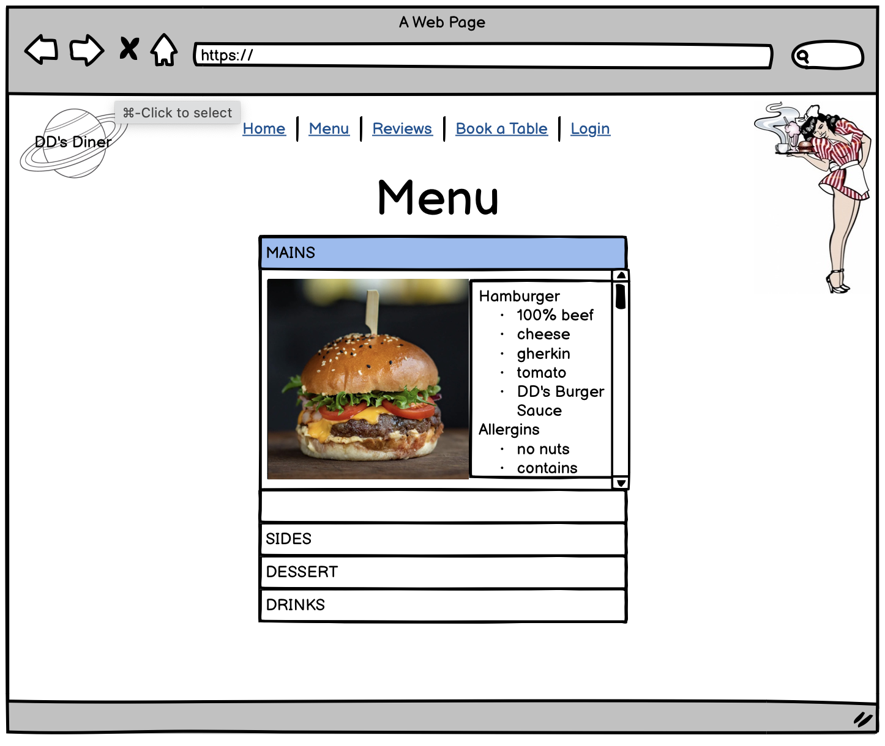

# DD's Diner
This is a website about a fictional diner where you can book a table, view your bookings and also edit or delete them too. It is my forth project for Code Institute, it uses [Django](https://www.djangoproject.com/). It is for educational purposes only.
You can view it [HERE](https://project-four-dds-diner.herokuapp.com/) on [Heroku](https://dashboard.heroku.com/), a cloud hosting provider.

## Target Audience
- For all ages
- People who are wanting to visit somethere to eat.
- Someone who might want to organise a meet up with friends or family at a restaurant.
- People who are into the 50's 60's era.
- Someone who just like looking at restaurant menus and making themselves hungry.. (so guilty at going this).
## User Stories
I have two types of user. The first is an admin user that can manage and delete booking, also delete reviews if they show inapporopriate langauge. The second type of user is the customers of DD's Diner. They can create, edit and delete their bookings, they can also write and like reviews.  The user can only do this, if they have created an account.

Here are the user stories, I made them into GitHub issues and created a project so I can track them using Kanban.
Please view this [HERE](https://github.com/users/Bethieieio/projects/2).

## Feature Priority
Here are the simplified user stories with their priority score. This is so I can prioritise time for the most important features.
1 being the least important, while 5 being the most.

| Feature      | Priority   |
| ----------- | ----------- |
| create reviews | 3 |
| like reviews | 2 |
| admin delete review | 2 |
| user create booking  | 5  |
| user edit booking  |  5 |
| user delete booking  |  5 |
| user to view bookings  |  5 |
| display resturant menu  | 3 |
| user can login / sign up    |  5 |
| overbooking validation  |  2 |
| create map  |  2 |

## Styles
### Wireframes
Here are the wireframes I created before starting this project. As you can see certain ideas never made it to the final project, for example the preorder section on the table booking page and some CSS styles and positions. But as a whole, the final site is accurate to these wireframes.

### Colour Schemes
I got inspiration from to use my chosen colours of red, yellow, off white from [Coolors](https://coolors.co/ebebeb-a82428-ffbe33-000000) (press link to see colours). Red and yellow stand out from eachother. They also represent colours from diners and two very famous fast food restuarants...
I chose black as it is bold and stands out from the other colours I have chosen. I chose an off white instead of a 'normal' white as I just wanted something different. I used the red mainly in the background border and navigation text. The off white as the main colour of text containers including the navigation bar background, the yellow as the main titles, accents on the off white containers, the hover colour on the nav, the main button colour and the colour the accordion title colour when they are clicked on. The black is used mostly for the main  text colour in the white containers.
### Typeography
I used two font types for this webite.
I used [Google Fonts]()
Pacifico  - for the the main titles and the logo. I felt that it was fancy and looked like a font that diners have. But I made sure it was wasy enough for people to read. 
Anek Gujarati - for the main text on the website. I felt it did not over power the page. easy for everyone to read. It look sleek and simple enough not to clash with the title font.
### Media
#### Photos
Below are the links and names of the people who look the photos I used for my project. They are either from [Unsplash](https://unsplash.com/) or -- [Pexels](https://www.pexels.com/). Thank you!!  
[Dayanara Nacion](https://unsplash.com/photos/HuIJUp6gTDI) - Hero Image.   
[Max Bovkun](https://unsplash.com/photos/UcQ0MLuw8IE ) - 50's night advertisement on hompage.   
[Valeria Boltneva](https://www.pexels.com/photo/close-up-photo-of-burger-1639562/) - Burger image in menu.   
[王 大洪](https://unsplash.com/photos/PPwYBaC_g8M) - Hot Dog image in menu.   
[Glady Francis](https://www.pexels.com/photo/bowl-of-fries-on-table-1586942/) - Fries in menu.   
[Anton Uniqueton](https://www.pexels.com/photo/crispy-waffle-fries-5384838/) - Waffle fries in menu.   
[Dana Tentis](https://www.pexels.com/photo/vegetable-salad-with-wheat-bread-on-the-side-1213710/) - Salad in menu.   
[Esperanza Doronila](https://unsplash.com/photos/4FO9vox0T7M) - Onion rings in menu.   
[Georgiana Mirela](https://www.pexels.com/photo/close-up-photo-of-potato-wedges-1439177/)
[Louis Hansel](https://unsplash.com/photos/OaGUHIjCdCs) Milkshake advertisement on homepage.   
[Richard Bell](https://unsplash.com/photos/ZFPz3caOmx8) - English breakfast adverrtisement on homepage.   
[Food Photographer](https://unsplash.com/photos/h7a8RsZFzgc) - Cola in menu.   
[Jonathan Borba](https://unsplash.com/photos/7TeR1A1MUpM ) - Milkshake image in menu.   
[ABHISHEK HAJARE](https://unsplash.com/photos/kkrXVKK-jhg) - Orange juice in menu.   
[Taisiia Shestopal](https://unsplash.com/photos/xO9NotFY4mU) - Latte in menu.   
[Paige Ledford](https://unsplash.com/photos/1Di03LTniYE) - Mocktail in menu.   
[Bao Menglong](https://unsplash.com/photos/y_wGdAJMdOo ) - Ribs in menu.   
[The Fry Family Food Co.](https://unsplash.com/photos/bA4AIZwauxc) - Vege chicken-style wrap.   
[Keriliwi](https://unsplash.com/photos/v_JswZL-s3k) - Chicken wings in menu.   
[Mink Mingle](https://unsplash.com/photos/LGNxQzYmeUk) - Cheesecake in menu.   
[Céline Druguet](https://unsplash.com/photos/vxWMHx7m8iY) - Sundae in menu.   
[Shivansh Sethi](https://unsplash.com/photos/dKT6Q7q2UKs) - Chocolate brownie in menu.   
[Yulia Khlebnikova](https://unsplash.com/photos/HLwc-ne0IQM) - Fruit salad in menu.  
[Edward Howell](https://unsplash.com/photos/ZXmxQ0Ny_IY) - Sticky toffee pudding in menu. 
#### ClipArt
[Logo](http://clipart-library.com/search1/?q=saturn#gsc.tab=1&gsc.q=saturn&gsc.page=1) - This is the logo located in the top left page throughout the website, the colours and DD's text was edited in.  
[Unused image](http://clipart-library.com/clipart/87973.htm) - This was the image I decided not to use, as I felt it did not fit well on the page. It is still in my wireframes.
## Testing
### Manual Testing
- Implementation: During the signing up process of the website, the email has to be a valid looking email address.
- Test: I attempted to sign up without an email structure as an email.
- Result: The page told me that the email I tried did not contain the @ symbol.

- Verdict: Successfull. A valid looking password needs to be input in order to sign up.
***
- Implementation: Makings sure the user cannot sign up with the same email address as before.
- Test: I tried signing up using an email address that is already in the database.
- Result: The page told me that a user has already sign up with the email address I have tried to enter.

- Verdict: Successful. You cannot sign up with a particular email address more than once.
***
- Implementation: User logging into the site.
- Test: I went to the login page of the site and input my email address and password. I also used different ways of logging in by using the button 
 located in on the 'book a table' and 'reviews' pages.
 
- Result: I signed in on the account the three times as explained above. Logging in from the sign in page directed me back to the homepage. Logging in by clicking the login button from the review page redirected me back to the reviews page. Finally, logging in using the log in on the 'book a table' page directs me to the booking form on the 'book a table' page.

- Verdict: All three times were a success, every time a pop appeared saying I was signed in. All the extra features were acccessible after I signed in.
***
- Implementation: Booking a table at DD's Dinner succesfully.
- Test: I used website to book a table at a specific time, date and number of guests. I also tried to see if it's possible to submit a blank table.
- Result: Once the tabe has been booked, it appears on the "Your Bookings" page. I saw the success message. You also cannot submit an empty form.

- Verdict: Success, the user will be able to book a table and are shown they have been booked by a success message.
***
- Implementation: If for whatever reason the user needs to change the date, time, number of heads of allergy needs on a booking they have created, they should be able to do so.
- Test: On the "Your Bookings" page, I found the booking I previously created. I clicked on it and the edit button was shown. I clicked on this and I was able to edit the date from the 24th to the 26th February,

- Result: When I requested for the date to be changed, I got a messaging saying that I have edited my booking sucessfully.

- Verdict: Successful. The pop up message appeared and the date can be seen that it was changed by two days.
***
- Implementation: If something came up for the user and they can no longer go to DD's Dinerm they can cancel their booking by deleting their booking. The user needs a quick and easy way to do so.
- Test: I viewed the booking that I recently edited and clicked the delete booking.
- Result: As soon as I clicked the delete button, the booking was deleted and a pop up appeared explaining that the deletion was successful.

- Verdict: It was successful, the booking has been deleted off the website and from the database.
***
- Implementation: The user wants to leave a review about their experience at DD's Diner.
- Test: Trying to leave a review before loggin in. When I was logged in, I left a test review on the 'reviews' page. 
- Result: When not logged in, I was unable to see the text area on the 'reviews' page. When I was logged in and after writing a comment on the text area required, the comment I left appeared on the page hastily.
- Verdict: As shown, the user needs to be logged in to be able to leave a review. Once they are logged in, they can leave as many reviews as they like. The pop up message confirms that the user submitted a review.

!

***
- Implementation: Liking reviews is a great way to show that you agree with another users review.  If a user liked a review my mistake, clicking the like icon again, will remove the like. Only users that have an account can like reviews.
- Test: While logged in, clicking on the heart shaped icon will change the colour of the heart to DD's Red. Whem not logged in, I will see how many people have liked the review, but unable to like the review myself.
- Result: Logged in by clicking the heart, it changes colour, this means it liked, clicking the heart again removes the like. When not logged in, I cannot like review.

- Verdict: This is all working as it should.  The right type of user are able to like the reviews.
***

- Implementation: The websites menu and users booking page accordions that use Bootstrap. As well as adding movement to the website, it also allows the user not to scroll to far down the page.
- Test: I tested this by repeatedly clicking all the avaliable accordion buttons. Making sure they all expand and retract with no issues.
- Result: All of the buttons worked, even spamming them they worked flawlessly. Each of them changed colour to the DD's yellow when they are expanded.
- Verdict: It was a success, I did everything in my power to try and break them, but they did not. (:
***

- Implementation:
- Test:
- Result:
- Verdict:
***

- Implementation: The admin needs to remove reviews if they contain words that are not acceptable to be shown on the website. So giving them the ability to delete them needs to be implicated.
- Test:
- Result:
- Verdict:

***
- Implementation:
- Test:
- Result:
- Verdict:
***

- 
- make sure admin can view reviews and bookings 
- make sure admin can delete reviews and bookings
- make sure menu accordions work and google map.
### HTML VALIDATION
### CSS VALIDATION
### PEP8 

installed pycodestyle which is a global command
used pycodestyle to point out validation failure by running `pycodestyle --first */*.py`
fixed each one manually and committed

## Packages, Languages and Frameworks
### Django
Django is an MVC (Model View Controller) framework. I have used Django as a backend service to provide endpoints, which render HTML using templates and handle POST form data. Django also handles user authentication tokens and sessions.
### AllAuth Customisation
- Because I wanted to add the first and last name of the user on sign up, I need to create a custom [AllAuth](https://django-allauth.readthedocs.io/en/latest/) adapter and cudtomer AllAuth signup form.
I did this by extending the default AllAuth adapter adding the first and last name field. Because I did not want to use the 'username' field, in the adapter, I set the username to be the email field and configured AllAuth to use the my custom adapter and email for sign in.
- I had some complications, which resulted in the need to set the username field to be the same as the email.
- I also found complications using my custom form on the homepage, when storing first name and last name, which required configuring AllAuth to use my custom sign up form.

### Crispy Forms
I installed [Crispy Forms](https://django-crispy-forms.readthedocs.io/en/latest/) so I could automatically render HTML from Django form classes. This also enables me to user Django forms to handle model data.

### Bootstrap
I installed [Bootstrap](https://getbootstrap.com/) to utilise it's style classes and components. I have used Bootstrap components with JavaScript events such as the mobile menu and accordion components.

### White Noise 
- [White Noise](http://whitenoise.evans.io/en/latest/) was used to host static files on Heroku.

### Other
- [Gunicorn](https://gunicorn.org/) - http server
- [SQLParse](https://pypi.org/project/sqlparse/) - SQL Driver
- [Python3](https://www.python.org/downloads/)
- [GitHib](https://github.com/) - version control
- [VS Code](https://code.visualstudio.com/) - IDE, where I wrote my codes.
- [ElephantSQL](https://www.elephantsql.com/) - PostGRES database, where all my tables are stored.
- [Font Awesome](https://fontawesome.com/) - for the Github symbol in the footer of the website.
- Pip3 is a package manager for python.
- HTML/CSS - structures and styles user interface.
- Mark Down - This read me in in Mark Down.

## Database
### Database Structure
This is the plan for my database structure. I have one table per model and I have included relationships. I used [DrawSQL](https://drawsql.app/).

<iframe width="100%" height="500px" style="box-shadow: 0 2px 8px 0 rgba(63,69,81,0.16); border-radius:15px;" allowtransparency="true" allowfullscreen="true" scrolling="no" title="Embedded DrawSQL IFrame" frameborder="0" src="https://drawsql.app/teams/penny-flight-pirates/diagrams/project-four/embed"></iframe>

#### User
- This table will be created using [AllAuth](https://django-allauth.readthedocs.io/en/latest/). It will supply basic user account functionality.
- The user will have to enter their email address, first and last names and a password to create an account.

#### Booking
- The table will be used for storing bookings against the user. 
- The user ID column as seen above, will be a foreign key that will relate to the user table.
- I would like to prevent overbooking by using group sizes to determine whether the time slot is fully booked.

#### Preorders
- I ended up not doing this as I was running out of time.
#### Reviews
- This table stores all the reviews about the restaurant written by the customers.
- Users can write more than review.
- The user ID column will be a foreign key that relates to the reviews table.

#### Review Likes
- This table stores all the likes the users leave to other users reviews.
- Users can like more than one review.
- This will have 2 foreign keys that relate it; user ID and review ID.

### Migrations
- In order to keep my database in sync with my database models in my application, I used Django models to create and update my database table structure.
- When running `python3 manage.py makemigrations` Django will check my database tables against my models in my application and create a unique migration file  which we can use to update table changes.
- Running `python3 manage.py migrate` will execute these migration changes.

## Resources 
### General Resources
- [Stack Overflow](https://stackoverflow.com/)
- [W3Schools](https://www.w3schools.com/)
- [Google Map IFrame Genertor](https://google-map-generator.com/).
The above helped me the most with this project when I needed guidence.
### Tools
- [PyCodeStyle](https://pypi.org/project/pycodestyle/) Used to test Python, as [PEP8 Validator](http://ww7.pep8online.com/) is still being weird.
- [W3C HTML Validator](https://validator.w3.org/) was used to test the HTML.
- [W3C CSS Validator](https://jigsaw.w3.org/css-validator/) was used to test the CSS.
- [Balsamiq](https://balsamiq.com/) created by wireframes
- [Chrome Dev Tools](https://developer.chrome.com/docs/devtools/) - self explanatory. 

## Deployment to Heroku 
- I commit and pushed all my work to Github
- Signed in and clicked on "New" and "New App".
- I named the deployment, and chose "Europe" region.
- Input all necessary config vars on the Heroku settings tab.
- I made a procfile to start Gunicorn on Heroku and commited these changes.
- On the deploy tab on Heroku, I connected my Github account and DD's Diner repository to it.
- Clicked 'Deploy Branch'. 
- Cliked on 'Open App' to view the DD's Diner site. 
- Now whenever I make a commit, it automatically deploys to Heroku.

> Because my local and heroku use the same database, there is no need for migrations when deploying.

## Honourable Mentions
- [My Partner in crime](https://github.com/bashleigh) Kept me as sane is she possibly could, and answered all the questions I had as simply as possible.
- My Mentor Rich, big ups to him. Thank you (:

note
fixed nav
future fixes